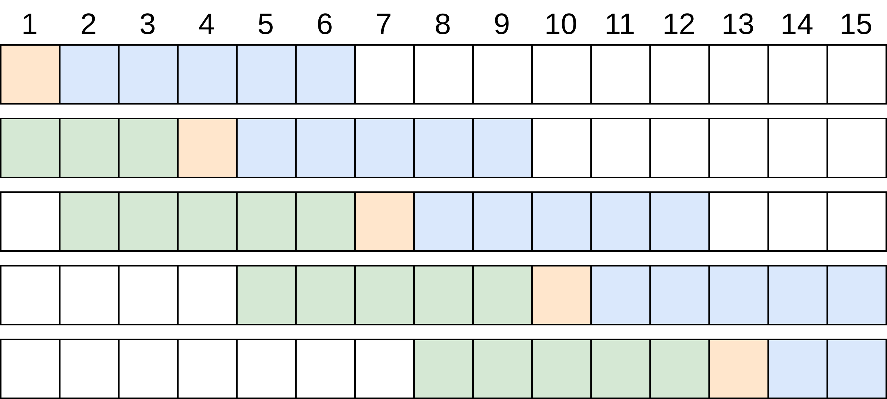

# ggruber193/automated-window-sliding: Usage

## Input and Output
A multiple sequence alignment in Fasta, Phylip, Nexus, Clustal or MSF format. Use this parameter to specify the location of the file.
```bash
--input <path to alignment file>
```
To specify the output directory where all result files of the pipeline will be stored use
```bash
--outdir <path to output directory>
```
This output directory will automatically be created by Nextflow.

## Splitting of the alignment
#### Sliding Window parameters
To adjust the size of the windows use `--window_size <integer>` and to adjust the distance between two consecutive windows use `--step_size <integer>`.

The first few and the last few windows are smaller than then specified by `--window_size`. This is the case, because the windows are created relative to the midpoint of the windows, with roughly half of the window size on either side of the midpoint. But each window has at least the length of half the window
size.

Example:




Here a window size of 11 and a step size of 3
was used. Notice that in the first two and in the last iteration the windows are smaller than specified
by the window size. This is the case, because the windows are constructed relative to the midpoint of the window, which is represented in orange.

The default parameters are `--window_size 300` and `--step_size 25`.

#### CSV file with custom windows
Alternatively a CSV file can be used to split the alignment into user defined windows. To do this use 

```bash
--window_file <path to CSV file>
```

The CSV file should contain no header and have at least two columns with start and end position, that define a single subalignment window. The positions should be specified in a one-based format, which means the first position in the alignment is 1 and not 0.

```csv title="custom_ranges.csv"
1,1000
1001,2000
2001,2200
2201,2539
```

Optionally a third column can be used to assign a name to the respective window. This name is then used as a filename for the generated subalignment window. If the third column is not provided the midpoint of the window is used as name.

```csv title="custom_ranges.csv"
1,1000,gene1
1001,2000,gene2
2001,2200,gene3
2201,2539,gene4
```

If you provided a nucleotide alignment and you want to use the reverse complement of a certain window you can do so by inverting the start and end position.

```csv title="custom_ranges.csv"
1,1000,gene1
1001,2000,gene2
2200,2001,gene3  # will result in the reverse complement of this window
2201,2539,gene4
```

## Pipeline Execution options
The pipeline provides an option to not perform the tree reconstruction step if only the subalignments are needed. For this the parameter `--run_mode` can be used.

There is a choice between three different run modes
- `--run_mode split`: is used to only perform the splitting of the alignment and output the generated subalignments in fasta format.
- `--run_mode model`: performs the splitting of the alignment and model selection. This is best used together with `--model_finder_splits` to only perform model selection for each subalignment. You then get a TSV file with the best-fit evolutionary model for each window.
- `--run_mode full`: performs the whole workflow from splitting the alignment, model selection to tree reconstruction and collection of the tree files. If you also want the subalignments used for tree reconstruction, you can output them with the flag `--output_windows`.

## Model Selection options
The best-fit evolutionary model is estimated using IQ-TREE ModelFinder.
The model selection can either be performed using the whole alignment or for each subalignment window separately. Per default the best-fit model is chosen based on the whole alignment. To perform model selection for each subalignment use the flag `--model_finder_splits`.

IQ-TREE ModelFinder uses three different information criteria to choose the best-fit evolutionary model (BIC, AIC, AICc). To choose which one should be used, use `--model_criterion <bic/aic/aicc>`.

Using `--model_finder_params` you can provide additional IQ-TREE parameters as a string. For example to restrict the evolutionary models that should be considered 
```bash
--model_finder_params "-mset GTR,K2P,etc."
```
or to increase the number of FreeRate categories
```bash
--model_finder_params "-cmax 20"
```

If you know beforehand which evolutionary model you want to use, you can use `--model`. The model should be provided in the notation that IQ-TREE uses. (http://www.iqtree.org/doc/Substitution-Models)

For example
```bash
--model GTR+F+R2
```

## Tree Reconstruction options
For the tree reconstruction there is a choice between two maximum-liklihood programs.
- IQ-TREE
- RAxML-ng

Per default IQ-TREE is used to perform tree reconstruction. By using `--phylo_method raxml-ng` you can switch to using RAxML-ng.

Using `--phylo_parameters` you can provide additional parameters for the tree reconstruction program as a string.

For example to enable Bootstrapping.

- IQ-TREE:
        ```
        --phylo_parameters "-b 1000"
        ```
- RAxML-ng:
        ```
        --phylo_parameters "--all --bs-tree 1000"
        ```

For a full overview of existing parameters please refer to the documentation of [IQ-TREE](http://www.iqtree.org/doc/) and [RAxML-ng](https://github.com/amkozlov/raxml-ng/wiki).

Per default only the resulting best-tree, consensus tree and logs are outputted, but both programs also generate additional files. If you want to keep all the files that are created during tree reconstruction you can do so with the flag `--keep_tree_files`.


## Ambiguous Sequences
A sequence in a window contains only ambiguous characters, will result in an error during the execution of IQ-TREE and RAxML, which leads to the abortion of the pipeline execution.

The pipeline provides three options to handle this error. By using using `--amb_seqs` you can change how subalignment windows with sequences containing only ambiguous characters should be handled.

- `--amb_seqs remove`: is used to remove sequences containing only ambiguous characters from the respective window. In this case a TSV file is generated that contains sequence headers of the removed sequences for each window.
- `--amb_seqs skip`: is used to skip the tree reconstruction step for windows with sequences containing only ambiguous characters.
- `--amb_seqs keep`: if this option is used the pipeline will crash, if any window has sequences containing only ambiguous characters.


## Output Format
The final result of the pipeline are two files containing all the best-trees that are generated by the tree reconstruction step, one in Newick and one in Nexus format. If only Nexus or Newick is needed, you can use `--output_format nexus` or `--output_format newick` to only output a single file.

The order of the trees in the output files is according to the position of the window along the alignment. In the case of a Nexus file the name of the trees corresponds to the midpoint of the window or if a CSV file with a names column was used to the specified names.


## Useful Nextflow arguments

These options are part of Nextflow and use a _single_ hyphen (pipeline parameters use a double-hyphen).

### `-profile`

Note that multiple profiles can be loaded, for example: `-profile test,docker` - the order of arguments is important!
They are loaded in sequence, so later profiles can overwrite earlier profiles.

If `-profile` is not specified, the pipeline will run locally and expect all software to be installed and available on the `PATH`.

- `docker`
    - A generic configuration profile to be used with [Docker](https://docker.com/)
- `singularity`
    - A generic configuration profile to be used with [Singularity](https://sylabs.io/docs/)
- `podman`
    - A generic configuration profile to be used with [Podman](https://podman.io/)
- `apptainer`
    - A generic configuration profile to be used with [Apptainer](https://apptainer.org/)

- `conda`
    - A generic configuration profile to be used with [Conda](https://conda.io/docs/). Alternatively [Mamba](https://github.com/mamba-org/mamba) can be used instead of Conda.
- `test`
    - A profile with a complete configuration for automated testing
    - Includes links to test data so needs no other parameters

### `-resume`

Specify this when restarting a pipeline. Nextflow will used cached results from any pipeline steps where the inputs are the same, continuing from where it got to previously.

You can also supply a run name to resume a specific run: `-resume [run-name]`. Use the `nextflow log` command to show previous run names.

### `-qs`

This parameter is used to limit the number of processes that can be run concurrently by Nextflow. This is helpful when running the pipeline on a local PC to not use up all computing resources.


## Resource allocation

Per default the number of CPUs that is used for running IQ-TREE and RAxML is determined dynamically for each subalignment, based on its length in relation to the total length of all subalignments combined. This ratio is multiplied with the number of CPUs specified with `--max_cpus` to get the number of CPUs that are used for the process. Using a sliding window this leads in most cases to allocating a single CPU for the execution of IQ-TREE or RAxML. The idea behind that is to perform as many tree reconstruction processes concurrently as possible, because the execution with a single subalignment should not take that long. In case a CSV-file was used to split the alignment a longer segment is present, then IQ-TREE or RAxML should be executed with a higher number of CPUs.

The memory and time for each process is specified in the [base.config](../conf/base.config) file.

These default resource allocations can be overwritten using your own config file and defining new resource directives. For example:

```bash
process {
    cpus = 6
    memory = 8.GB
    time = 10.h
}
```

You can run the pipeline using your custom config file by using `-c`. For example:
```bash
nextflow run ggruber193/automated-window-sliding -c my_config.config <other options>
```

You can also use label selector to specifically target the Model Selection and Tree Reconstruction processes.

To change resources for the Tree Reconstruction processes use:

```bash
process {
    withLabel:process_medium{
        cpus = 6
        memory = 8.GB
        time = 10.h
    }
}
```

and to change resources for the Model Selection process use:
```bash
process {
    withLabel:process_high{
        cpus = 6
        memory = 8.GB
        time = 10.h
    }
}
```

This way also the execution platform can be changed. Per default Nextflow uses the local executor to run the pipeline. If you want to submit jobs to a SLURM cluster, SGE or Google Cloud Batch you can also use a config file and specify a different executor.

For example to run the pipeline using a Sun Grid Engine cluster use a config that includes:

```bash
 process {
    executor = 'sge'
 }
```

In this case the Nextflow run command needs to be called from a node where the `qsub` command is available. For more information refer to the [official documentation](https://www.nextflow.io/docs/latest/executor.html#sge).


For example to run the pipeline on Google Cloud Batch use:

```bash
process {
    executor = 'google-batch'
}

google {
    project = '<projectId>'
    location = '<location>'
}
```

Running on Google Cloud Batch requires some setup that has to be done beforehand. Its best to refer to the [Nextflow documentation](https://www.nextflow.io/docs/latest/executor.html#google-cloud-batch) for this.

For a overview of all execution platform go to the [Executors section]((https://www.nextflow.io/docs/latest/executor.html#)) of the Nextflow documentation and for a more detailed description of possible configurations look at the [Configurations section](https://www.nextflow.io/docs/latest/config.html).


# Overview of all parameters

## Input/output options

Define where the pipeline should find input data and save output data.

| Parameter | Description | Type | Default | Required | Hidden |
|-----------|-----------|-----------|-----------|-----------|-----------|
| `input` | Input alignment file in Fasta, Phylip, Nexus, Clustal or MSF format. | `string` |  | True |  |
| `outdir` | The output directory where the results will be saved. You have to use absolute paths to storage on Cloud infrastructure. | `string` |  | True |  |

## Workflow options


| Parameter | Description | Type | Default | Required | Hidden |
|-----------|-----------|-----------|-----------|-----------|-----------|
| `run_mode` | Specify the what parts of the pipeline should be executed. "split" is used to only perform the splitting of the alignment. "model" is used to perform splitting and model selection. "full" is used to perform the whole pipeline. <details><summary>Help</summary><small>Using "split" outputs the individual subalignment windows per default.</small></details>| `string` | full |  |  |
| `output_windows` | Flag used to also output the subalignment windows. | `boolean` |  |  |  |
| `window_size` | Number of nucleotides each window contains at most. Windows on the edge of the alignment can contain less nucleotides but at least half of the window size. | `integer` | 300 |  |  |
| `step_size` | Distance between two windows. | `integer` | 25 |  |  |
| `window_file` | CSV file with alignment ranges. If this parameter is provided the alignment ranges specified in the file are used instead of "window_size" and "step_size". <details><summary>Help</summary><small>The CSV file should contain no header and have at least two columns. First the start position and second the end position. The positions are specified in a one-based format.<br>Optionally a third column can be used to give each subalignment window a custom name, otherwise the midpoint of the window is used as the name. The name is used for the filename of the subalignment and also for the name of the tree in the final Nexus file of the pipeline.<br>If a nucleotide alignment (DNA/RNA) is used the start- and end-position of a window can be swapped to get the reverse complement of this subalignment window.<br><br>Example:<br>1,1000,gene1<br>1001,2000,gene2</small></details>| `string` |  |  |  |
| `amb_seqs` | Change the behaviour of how subalignments containing sequences with only ambiguous characters. "remove" is used to remove sequences containing only ambiguous characters. "ignore" is used to skip subalignments with such sequences. "keep" does not manipulate or skip subalignments but if such sequences are present the pipeline will crash. <details><summary>Help</summary><small>Alignments that contain sequences with only ambiguous characters will result in error during tree reconstruction.<br>Three ways are provided to handle these cases. <br>- "remove": removes a sequence containing only ambiguous characters from the subalignment where this is the case.<br>- "ignore": is used to skip subalignments with such sequences.<br>- "keep": does not manipulate or skip subalignments but if such sequences are present the pipeline will crash.</small></details>| `string` | remove | True |  |
| `model_criterion` | Specify the model selection criterion that should be used. | `string` | bic | True |  |
| `model` | Can be used to specify the evolutionary model that should be used. In IQ-TREE format. | `string` |  |  |  |
| `model_finder_splits` | Flag that is used to perform model selection on each subalignment window separately. | `boolean` |  |  |  |
| `model_finder_params` | Can be used to pass additional parameters to the model selection process. The model selection process uses IQ-TREE ModelFinder. E.g. "-mset GTR,...". to restrict model selection. | `string` |  |  |  |
| `phylo_method` | Specify the program that is used for performing tree reconstruction. | `string` | iqtree2 | True |  |
| `phylo_parameters` | Can be used to pass additional command-line parameters to the tree reconstruction process. E.g. "-b 1000" to perform tree reconstruction with bootstrap. | `string` |  |  |  |
| `output_format` | Format of the output file containing all trees that were created. Can either be nexus, newick or both. Specified using a comma separted list. E.g. "newick,nexus" | `string` | nexus,newick | True |  |
| `keep_tree_files` | Flag that is used to output all additional files that were generated during the tree reconstruction step. | `boolean` |  |  |  |

## Generic options

Less common options for the pipeline, typically set in a config file.

| Parameter | Description | Type | Default | Required | Hidden |
|-----------|-----------|-----------|-----------|-----------|-----------|
| `help` | Display help text. | `boolean` |  |  |  |
| `version` | Display version and exit. | `boolean` |  |  | True |
| `publish_dir_mode` | Method used to save pipeline results to output directory. <details><summary>Help</summary><small>The Nextflow `publishDir` option specifies which intermediate files should be saved to the output directory. This option tells the pipeline what method should be used to move these files. See [Nextflow docs](https://www.nextflow.io/docs/latest/process.html#publishdir) for details.</small></details>| `string` | copy |  | True |
| `monochrome_logs` | Do not use coloured log outputs. | `boolean` |  |  | True |
| `validate_params` | Boolean whether to validate parameters against the schema at runtime | `boolean` | True |  | True |
| `validationShowHiddenParams` | Show all params when using `--help` <details><summary>Help</summary><small>By default, parameters set as _hidden_ in the schema are not shown on the command line when a user runs with `--help`. Specifying this option will tell the pipeline to show all parameters.</small></details>| `boolean` |  |  | True |
| `validationFailUnrecognisedParams` | Validation of parameters fails when an unrecognised parameter is found. <details><summary>Help</summary><small>By default, when an unrecognised parameter is found, it returns a warinig.</small></details>| `boolean` | True |  | True |
| `validationLenientMode` | Validation of parameters in lenient more. <details><summary>Help</summary><small>Allows string values that are parseable as numbers or booleans. For further information see [JSONSchema docs](https://github.com/everit-org/json-schema#lenient-mode).</small></details>| `boolean` |  |  | True |

## Institutional config options

Parameters used to describe centralised config profiles. These should not be edited.

| Parameter | Description | Type | Default | Required | Hidden |
|-----------|-----------|-----------|-----------|-----------|-----------|
| `config_profile_name` | Institutional config name. | `string` |  |  | True |
| `config_profile_description` | Institutional config description. | `string` |  |  | True |

## Max job request options

Set the top limit for requested resources for any single job.

| Parameter | Description | Type | Default | Required | Hidden |
|-----------|-----------|-----------|-----------|-----------|-----------|
| `max_cpus` | Maximum number of CPUs that can be requested for any single job. <details><summary>Help</summary><small>Use to set an upper-limit for the CPU requirement for each process. Should be an integer e.g. `--max_cpus 1`</small></details>| `integer` | 1 |  |  |
| `max_memory` | Maximum amount of memory that can be requested for any single job. <details><summary>Help</summary><small>Use to set an upper-limit for the memory requirement for each process. Should be a string in the format integer-unit e.g. `--max_memory '8.GB'`</small></details>| `string` | 8.GB |  |  |
| `max_time` | Maximum amount of time that can be requested for any single job. <details><summary>Help</summary><small>Use to set an upper-limit for the time requirement for each process. Should be a string in the format integer-unit e.g. `--max_time '2.h'`</small></details>| `string` | 1.h |  |  |
